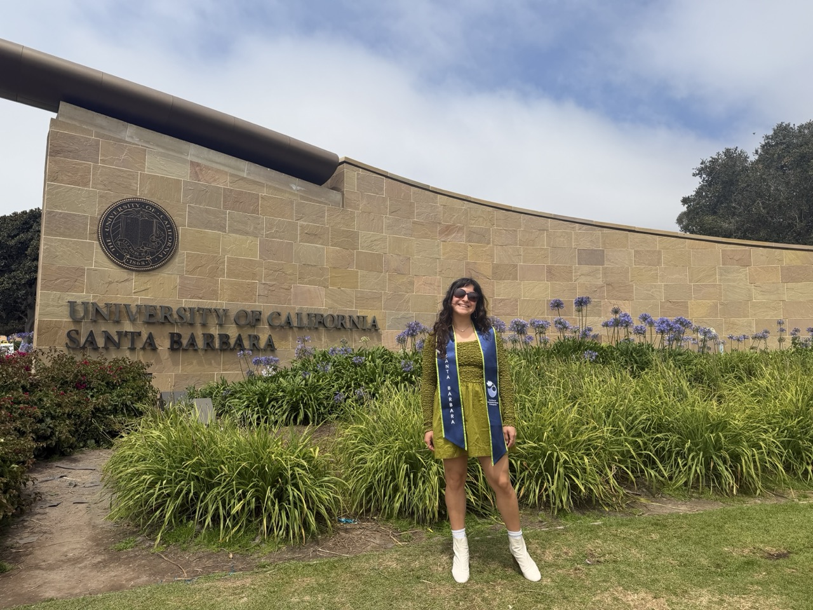
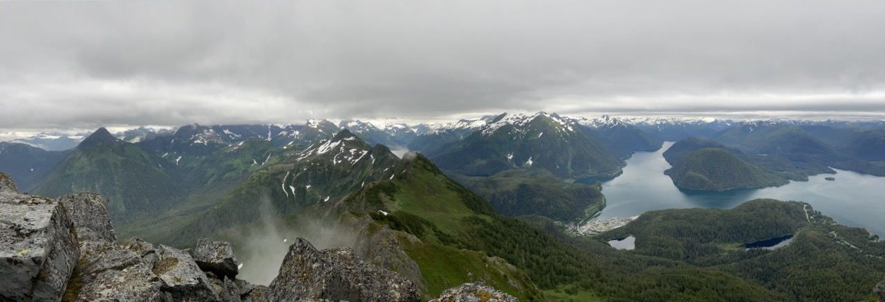

## Professional aspirations

I enjoy synthesizing policy, science, data, and socio-economic data into actionable reports. I am also passionate about conservation especially in marine ecosystems. 

I completed my undergraduate education in environmental studies from Vassar College where I focused in marine conservation, biology, and anthropology. Receiving an interdisciplinary degree makes me passionate about finding multi-faceted solutions to complex sustainability and conservation issues. Adding data analysis skills to my portfolio allows me to better address complex environmental issues. I am excited to apply my new found data skills to my passion of environmental investigations. 
 
## Hobbies 

I love being outside! My favorite activities are swimming leisurely in the ocean, jogging to the beach, hiking to a good view, and kayaking to explore marine life. I also love art. I enjoy ceramics, print making, and collaging. I have a passion for  travel where I explore the outdoors, art, and culture in new environments. 