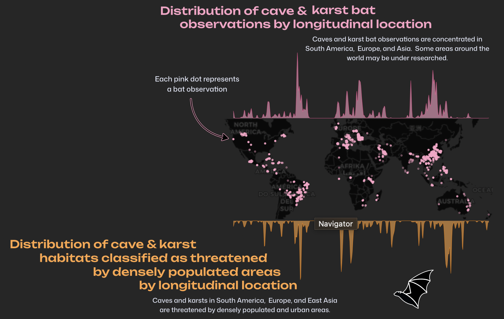
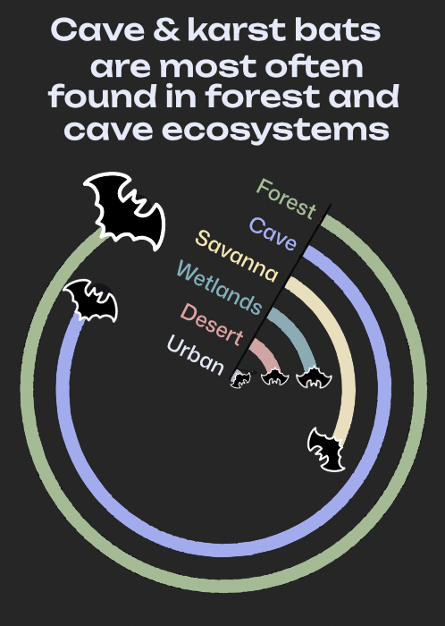
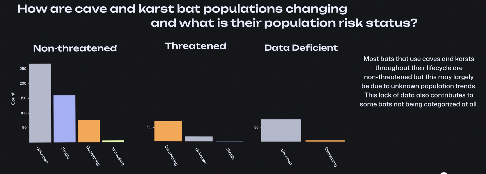

## Introduction
Bats are keystone species for caves and karsts acting as sources of nutrient resources from outside ecosystems (Tanalgo, 2022). These inputs are vital for the health of cave and karst ecosystems. However, conservation efforts often overlook these less researched and less prominent ecosystems. [DarkCideS 1.0](https://darkcides.wordpress.com/) aims to fill the gap in research by creating an open source database for information on cave and karst dwelling bats. The bats included in DarkCideS 1.0's data includes bats that use caves and karsts at any point in their life cycle. My visual is intended to synthesize some of the information included in the DarkCideS 1.0 database to visualize the following questions.   

**1. What regions have the most research on cave and karst bats and what regions are most threatened by densely populated and urban areas?**  

**2. What other ecosystems do cave and karst bats rely on? From which ecosystems are the nutrient sources and other resources entering caves and karsts?** 

**3. How are the populations of threatened and non-threatened bats changing?**   
 

You can explore the the [full repository](https://github.com/sofiiir/eds240-infographic) and code used to create this infographic.

 
 
## Design Elements

I made my graphic with a combination of {ggplot2} and Affinity design. All text was added in Affinity to better manipulate fonts and spacing. The font was chosen to evoke a sense of being in a cave with hard edges being a focal point. I chose to make the overall infographic dark to add to the overall cave feeling. The colors for each plot was selected to stand out on the dark background. 

# Map and distribution plots

 
 
My favorite graphic from my infographic is the map sandwiched between the two distribution plots. The original graphic of the distribution plots and the map were made using {ggplot2}. The top distribution plot shows the distribution of cave and karst bats based on longitude location. This distribution plot correlates with the points on the map. Each point on the map depicts the location of individual bat observations. The distribution plot on the bottom shows the distribution of caves and karsts used by bats that are threatened by dense populations and urban areas. I made the distribution plots look like karsts and added a bat to further amplify the bat visual. I love this graphic form because it depicts a large amount of information in a relatively small amount of space. 

The distribution of cave and karst bats based on longitude location and the points on the map showing the individual observations of cave and karst bats are shown in the same color to denote that they are the same values depicted in different formats. The text was added in Affinity to manipulate the spacing and fonts. The arrow was also added in Affinity to better display what the points on the map show. 

My subheading discussing possible research gaps is intended to inform on the possible gaps in the data and show where resources can be deployed to gain a better understanding of bats globally.

# Bat ecosystem visualization


The importance of bats that use caves and karsts at some point of their life cycle is that they bring nutrients from other ecosystems into caves and karsts. This is vital for the health of the cave and karst ecosystems. The ecosystem use visual was made to look like bats flying into a cave. I also chose this visual form because the values are so divergent between the ecosystems. Making the plot a circular plot allows you to easily see all of the information, while reducing eye movement. 

Each bar is in a color that correlates with the ecosystem they were observed in. The length of each bar shows the number of observations in each ecosystem as does the size of the bats. I made the original visual in {ggplot2} and added the bats in Affinity. 

# Bat trends population graphic 

Finally, I made a barplot that shows population trends for bats. I divided the bat populations into those that are non-threatened, threatened, and data deficient. Bat population trends are then categorized as unknown, stable, increasing, and decreasing. I left in the populations that do not have enough data to know either their population status or their trends because it further exhibits research gaps. Faceted bar plots are the best visual for this data because the scales are so different between the different population trends.


 
 
# Explore the code
Below is the code to make all of the elements of the infographic visual. This code gives the output in the {ggplot2} form and can be manipulated in Affinity to recreate the infographic.

```{r}
#| message: false
#| warning: false
#| eval: false 
#| code-fold: true

# load in necessary libraries
library(tidyverse)
library(png)
library(ggtext)
library(sf)
library(tmap)
library(cowplot) # to layer tmap and ggplot
library(ggplotify)
library(ggspatial)

# read in data
bats <- read_csv(here::here("data", "figshare-bat-data", "Dataset_1.csv")) |> 
  janitor::clean_names()

#...................POPULATION TRENDS BARPLOTS...............

# calculate population trend values
pop_status_df <- bats |> 
  summarise(.by = c(population_status, extinction_risk), value = n()) |> 
  arrange(value) |> 
  ungroup()

# set a population trends color palette
ext_pal <- c("Decreasing" = "#FFA545",
                 "Unknown" = "white",
                 "Stable" = "#A4B1F9",
             "Increasing" = "#DFFAA5")

# threatened bat species barplots
threatened_bp <- pop_status_df |> 
  filter(extinction_risk == "Threatened") |> 
ggplot() +
  geom_col(aes(x = fct_reorder(population_status, value, .desc = TRUE),
               y = value,  fill = population_status)) +
  theme_minimal() + 
  labs(y = "Count") +
  scale_fill_manual(values = ext_pal) +
  theme(axis.title.x = element_blank(),
        legend.position = "none",
        panel.background = element_rect(
        color = "transparent",
        fill = "transparent"
      ),
      plot.background = element_rect(
        color = "transparent",
        fill = "transparent"
      ),
      panel.grid = element_blank()
      ) +
  scale_y_continuous(
    limits = c(0, 275),                 # Set y-axis range from 10 to 35
    breaks = c(25, 50, 75, 100, 200) # Specify custom tick locations
  )

# nonhtreatedned bat species barplot
nonthreatened_bp <- pop_status_df |> 
  filter(extinction_risk == "Non threatened") |> 
ggplot() +
  geom_col(aes(x = fct_reorder(population_status, value, .desc = TRUE),
               y = value,  fill = population_status)) +
  # facet_wrap(~extinction_risk, nrow = 3) + 
  theme_minimal() + 
  labs(y = "Count") +
  scale_fill_manual(values = ext_pal) +
  theme(axis.title.x = element_blank(),
        legend.position = "none",
        panel.background = element_rect(
        color = "transparent",
        fill = "transparent"
      ),
      plot.background = element_rect(
        color = "transparent",
        fill = "transparent"
      ),
      panel.grid = element_blank())+
  scale_y_continuous(
    limits = c(0, 275),                 # Set y-axis range from 10 to 35
    breaks = c(25, 50, 75, 100, 125, 150, 175, 200, 225, 250, 275) # Specify custom tick locations
  )

# data deficient bat species barplot
data_deficient_bp <- pop_status_df |> 
  filter(extinction_risk == "Data Deficient") |> 
ggplot() +
  geom_col(aes(x = fct_reorder(population_status, value, .desc = TRUE),
               y = value,  fill = population_status)) +
  theme_minimal() + 
  labs(y = "Count") +
  scale_fill_manual(values = ext_pal) +
  theme(axis.title.x = element_blank(),
        legend.position = "none",
        panel.background = element_rect(
        color = "transparent",
        fill = "transparent"
      ),
      plot.background = element_rect(
        color = "transparent",
        fill = "transparent"
      ),
      panel.grid = element_blank()) +
  scale_y_continuous(
    limits = c(0, 275),                 # Set y-axis range from 10 to 35
    breaks = c(25, 50, 75, 100, 125, 150, 175, 200, 225, 250, 275) # Specify custom tick locations
  )


#...................BAT ECOSYSTEM OBSERVATIONS ...............

# convert the dummy variables into one tidy column
ecosystem_bats <- bats |> 
  select(species_name, forest, savanna, dessert, urban, cave, wetlands) |> 
  mutate(forest = case_when(forest == 1 ~ "forest", 
                            forest == 0 ~ NA)) |> 
  mutate(savanna = case_when(savanna == 1 ~ "savanna", 
                              savanna == 0 ~ NA)) |> 
  mutate(desert = case_when(dessert == 1 ~ "desert",
                            dessert == 0 ~ NA))  |> 
  mutate(urban = case_when(urban == 1 ~ "urban",
                           urban == 0 ~ NA)) |> 
  mutate(cave = case_when(cave == 1 ~ "cave",
                          cave == 0 ~ NA)) |> 
  mutate(wetlands = case_when(wetlands == 1 ~ "wetland",
                              wetlands == 0 ~ NA)) |> 
  pivot_longer(cols = c(forest, savanna, desert, urban, cave, wetlands),
               names_to = "ecosystem_type",
               values_to = "ecosystem") |> 
  filter(!is.na(ecosystem)) |> 
  select(species_name, ecosystem)

# calculate the number of bats in each ecosystem
ecosystem_bat_values <- ecosystem_bats |> 
  group_by(ecosystem) |> 
  summarise(value = n()) |> 
  arrange(value) |> 
  ungroup()

# add an extra row for spacing
ecosystem_bat_values <- add_row(ecosystem_bat_values, 
                                ecosystem = "clear", 
                                value = 700 )

# set an ecosystem color palette
ecosystem_pal <- c("clear" = "#15161A", # use background color of visual
                   "forest" = "#A1BD93", 
                   "savanna" = "#FAE7AE", 
                   "desert" = "#E8A1A1",
                   "urban" = "#E5EAFA",
                   "cave" = "#E4B9C8",
                   "wetland" = "#74B2BC")

# construct the ecosystem graphic
ecosystem_bat_plot <- ecosystem_bat_values |> 
  arrange(value) |>  # maintain the order of high to low ecosystem use
ggplot(aes(x= fct_inorder(ecosystem), 
           y = value + 50, 
           color = ecosystem, 
           fill = ecosystem)) +
  ggforce::geom_link(aes(x = ecosystem,  # create the lines
                         xend = ecosystem,
                         y = 0,
                         yend = value + 50,
                         color = ecosystem,
                         color = after_scale(colorspace::desaturate(color, .3))),
                     n = 30,
                     size = 5) +
    ggpattern::geom_tile_pattern(fill = "transparent" # add the bats
                                 # pattern = "image",
                                 # pattern_filename = here::here("data", "noun-bat-8134648.png")
                                 ) +
#  geom_text(aes(label = value)) + 
   annotate(geom = "segment",
            x = 0.8, xend = 6.5,
             y = 1, yend = 1,
            linewidth = 0.6) +
  scale_color_manual(values = ecosystem_pal) + 
  coord_polar(theta = "y", 
              start = 7,
             clip = "off"
              ) + # turn this plot circular
  theme_minimal() + 
  theme(panel.grid.major.y = element_blank(),
        panel.grid.major.x = element_blank(),
        panel.grid.minor.x = element_blank(),
        panel.grid.minor.y = element_blank(),
        axis.title.x = element_blank(),
        axis.text = element_blank(),
        panel.background = element_rect(
        color = "transparent",
        fill = "transparent"), 
        plot.background = element_rect(
         color = "transparent",
         fill = "transparent"),
        legend.position = "none") +
  labs(x = "")

#......................MAP AND DISTRIBUTION PLOTS.....................

# read in geospatial data sets
cave_bats <- read_csv(here::here("data", "figshare-bat-data", "Dataset_2.csv")) |> 
  janitor::clean_names() |> 
  rename(latitude = lattitude)

landscape_vul <- read_csv(here::here("data", "figshare-bat-data", "Dataset_3.csv")) |> 
  janitor::clean_names()

# convert the longitude and latitude data to mappable geometry
geo_cave_bats <- st_as_sf(cave_bats, coords = c("longitude", "latitude"), crs = st_crs(4326))
geo_landscape_vul <- st_as_sf(landscape_vul, coords = c("longitude", "latitude"), crs = st_crs(4326))

# convert to a geographic crs
geo_cave_bats <- st_transform(geo_cave_bats, 3857)
geo_landscape_vul <- st_transform(geo_landscape_vul, 3857)

# map the data 
ggplot_map <- ggplot(geo_cave_bats) +
  ggspatial::annotation_map_tile(type = "cartodark") + # higher zoom values are more detailed 
  geom_sf(aes(), 
          color = "#FBA2C6",
          alpha = 0.4) + 
  theme_minimal() + 
  theme(panel.grid = element_blank(),
        axis.text = element_blank(),
        plot.margin = margin(0, 0, 0, 0))

# distribution plot of bat observations
dist_cave_bats <-
  cave_bats |> 
  ggplot(aes(longitude)) +
    geom_density(
      color = colorspace::darken("#FBA2C6", .2, space ="HLS"),
      fill = "#FBA2C6",
      alpha = .6,
      size = .3,
      bw = .5
    ) +
  theme(
      panel.background = element_rect(
        color = "transparent",
        fill = "transparent"
      ),
      plot.background = element_rect(
        color = "transparent",
        fill = "transparent"
      ),
      plot.margin = margin(b = -1.4, t = 1.6),
      axis.title = element_blank(),
      axis.text = element_blank(),
      axis.ticks = element_blank(),
      panel.grid = element_blank()
    ) 

# filter the data for cave and karsts vulnerable to high populations and urban areas
pop_vul_caves <- landscape_vul |> 
  filter(urban_dist < 1001 | pop_dens > 500) 

# distribution plot of cave and karsts vulnerable to high populations and urban areas
dist_pop_vul <-  pop_vul_caves |> 
  ggplot(aes(longitude)) +
    geom_density(
      color = colorspace::darken("#FFA545", .2, space ="HLS"),
      fill = "#FFA545",
      alpha = .6,
      size = .3,
      bw = .5
    ) +
    # scale_x_continuous(
    #   expand = c(.01, .01),
    #   limits = c(-200, 200)
    # ) +
  theme(
      panel.background = element_rect(
        color = "transparent",
        fill = "transparent"
      ),
      plot.background = element_rect(
        color = "transparent",
        fill = "transparent"
      ),
      plot.margin = margin(b = -1.4, t = 1.6),
      axis.title = element_blank(),
      axis.text = element_blank(),
      axis.ticks = element_blank(),
      panel.grid = element_blank()
    ) + 
  scale_y_reverse()

# arrange the distribution plots and map
bat_distribution <- 
  ggdraw(ggplot_map) + 
  draw_plot(dist_cave_bats,
            x =  0,
            y = .701,
            width = 1,
            height = .3
            ) +
  draw_plot(dist_pop_vul, 
            x = 0,
            y = 0.03,
            width = 1,
            height = .27
            )

```
 

# References
Tanalgo, K.C., Tabora, J.A.G., de Oliveira, H.F.M. et al. DarkCideS 1.0, a global database for bats in karsts and caves. Sci Data 9, 155 (2022). https://doi.org/10.1038/s41597-022-01234-4

Tanalgo, Krizler; Tabora, John Aries G.; Oliveira, Hernani Fernandes Magalhães; Haelewaters, Danny; Beranek, Chad T.; Otálora-Ardila, Aída; et al. (2021). Metadata for: DarkCideS 1.0, a global database for bats in karsts and caves. figshare. Dataset. https://doi.org/10.6084/m9.figshare.16413405.v4