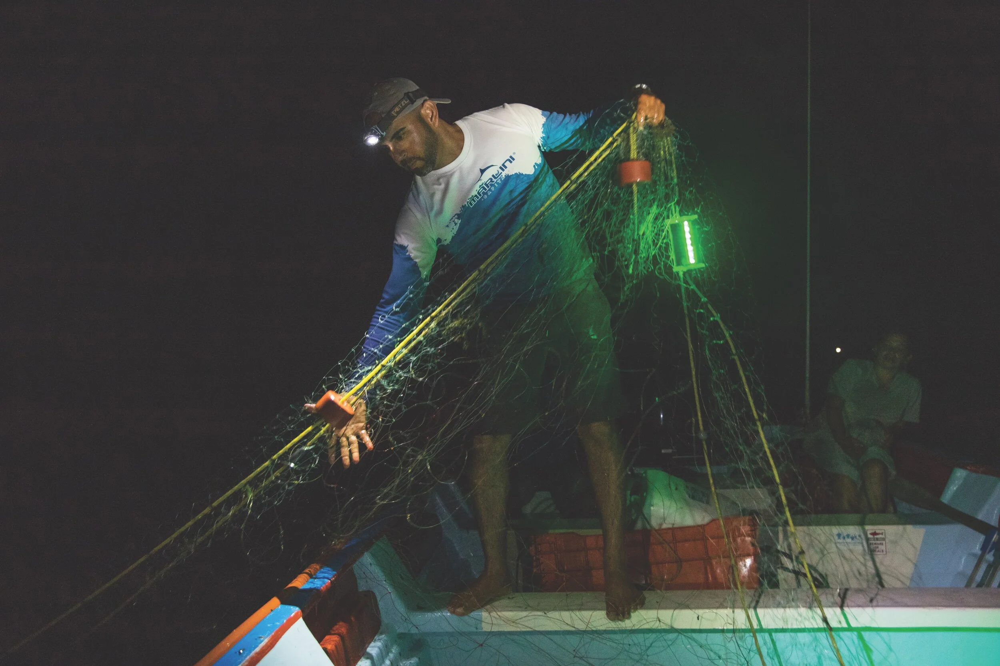

# Introduction

This blog post replicates the study Harnessing Solar Energy to Reduce Sea Turtle Bycatch, Senko, J. et al. 2025, which studies how illuminating fish nets with solar powered lights effects target fish catch and bycatch. This study explores solar lighting as it is a sustainable solution to illuminating nets which previous research has indicated reduces large animal bycatch. The goal of the illumination of the nets in this study is to determine whether solar lights significantly reduce sea turtle bycatch. The study analyzes the Bycatch Per Unit Effort (BPUE) of sea turtles and the Catch Per Unit Effort (CPUE) for target fish species.

The hypothesis is that illuminating fishing nets with solar powered lights will reduce BPUE but not impact CPUE. This paper builds on the findings of other research that has found illumination to be helpful in combating sea turtle bycatch.

The CPUE and BPUE studies both have illuminated nets (treated) and controlled nets (untreated) to analyze if catches are different for each animal category. They deployed both sets of nets in CPUE and BPUE analysis in Baja California Sur, Mexico with the help and input of local fisherman.

Load libraries first. 

```{r}
#| code-fold: true

library(tidyverse)
library(mgcv)
library(stats)
library(here)
library(DHARMa)
library(kableExtra)
library(performance)
```

Load fishnet illumination data.

```{r}
#| code-fold: true

catch_data <- read_csv(here("blog", "fishnet-illumination", "data", "fishnet_illumination_bpue.csv"))
```

## Data Description

The data for this study, Senko et al 2025, consists of 4 columns and 784 rows.

| Column Header | gillnet_pair | animal_type | exp_unit | bpue |
|----|----|----|----|----|
| Description | A numeric value 1-28 indicating which gillnet pair this sample is from. | Categorical variable describing which animal type this observation is for. | Categorical variable indicating treatment (illuminated) or control. | Numeric value of catch. This number is on the scale of BPUE or CPUE depending on animal type. |

Our key outcome variable for this study is BPUE/CPUE, with variations of animal type as a grouping variable (turtle BPUE or target fish CPUE). Our treatment is exp_unit, indicating gillnet bycatch observations comparing treatment methods, illuminated net or not. This study compared 28 gillnet pairs of equal size/material over a time period of July-September 2019 (assessing sea turtle bycatch) and February-March 2020 (assessing target fish catch). These experiments were conducted in Baja California Sur (BCS), Mexico, where bottom-set gillnet results in high bycatch rates and subsequent mortality of sea turtles. The unit of observation for this study is gillnet ID. 

**The data for this study is not available publicly at this time. A similar dataset was located on Jesse Senko's, the first author, [Open Science Framework](https://osf.io/fmxby/files/u2y8e). The data located to recreate the methods of this study has the same data components, however, differences in findings are likely due to the data discrepancies. Since the original study being recreated employed a novel flashing solar illumination method the data located for this analysis recreation is likely using static illumination powered by batteries or glow sticks. This data analysis recreation is therefore for learning purposes only!**

Each row is an observation of total BPUE/CPUE for that gillnet pair, treatment or control type, and animal type for the time period of this experiment. We have cleaned column headers/variable names and have pivoted the data from wide to long outside of this script. We did not perform any data cleaning that resulted in loss of data.

In this tutorial readers will see a case study of the use of a GLMM with the Tweedie distribution. Readers will also learn about the assumptions for the GLMM and Tweedie distribution as well as how to conduct model checks that verify that the appropriate model is being utilized.

# General Linear Mixed Model (GLMM) with a Tweedie distribution

This paper uses a Generalized Linear Mixed Model (GLMM) which uses both random and fixed effects. A GLMM is best for dealing with data that is non-normally distributed data that are not independent of each other. Specifically, they use a Tweedie model which is used when the data distribution includes zero and is continuously positive otherwise. Since the intention of the tutorial is to follow the methods of Senko, J. et al. 2025, all of the methods were replicated as denoted in their paper. The paper does not address assumptions, best fit, or reasons for choosing the specific model. Hence this tutorial attempts to extrapolate their reasoning.

## BPUE and CPUE data frame cleaning

The paper runs separate statistical analysis on Bycatch Per Unit Effort (BPUE) and Catch Per Unit Effort (CPUE). The BPUE analysis was only completed for sea turtles, not for all by-catch but we'll run analysis on both at least for exploration.

First, let's make two separate data frames one for BPUE and one for CPUE.

BPUE is created by just selecting the appropriate rows.

```{r}
#| code-fold: true

# clean bpue data
bpue <- catch_data |> 
  filter(animal_type == "total_bpue" | animal_type == "non_finfish_bpue" | animal_type == "finfish_bpue" | animal_type == "elasmobranch_bpue" | animal_type == "humboldt_squid_bpue" | animal_type == "loggerhead_biomass_bpue" | animal_type == "loggerhead_number_bpue")

# filter for sea turtles only
turtle_bpue <- catch_data |> 
  filter(animal_type == "loggerhead_biomass_bpue" | animal_type == "loggerhead_number_bpue")
```

CPUE names are wrong. Filter for the appropriate rows, then pivot to make changing the names easier before pivotting back for a tidy data frame.

```{r}
#| code-fold: true

# clean cpue data
cpue <- catch_data |> 
  filter(animal_type == "total_fish_bpue" | animal_type == "total_primary_fish_bpue" | animal_type == "halibut_bpue" | animal_type == "grouper_bpue" | animal_type == "total_secondary_fish_bpue") |> 
  pivot_wider(names_from = animal_type,
              values_from = bpue) |> 
  # rename observations from bpue to cpue
  rename("total_fish_cpue" = "total_fish_bpue", 
         "total_primary_fish_cpue" = "total_primary_fish_bpue",
         "halibut_cpue" = "halibut_bpue",
         "grouper_cpue" = "grouper_bpue",
         "total_secondary_fish_cpue" = "total_secondary_fish_bpue") %>% 
  pivot_longer(cols = c(total_fish_cpue, 
                        total_primary_fish_cpue, 
                        halibut_cpue, 
                        grouper_cpue, 
                        total_secondary_fish_cpue)) |> 
  # rename columns
  rename("treatment"= "exp_unit",
         "catch" = "name",
         "cpue" = "value")
```

# `GLMM` on the BPUE data

### Convert appropriate variables to be a factor

```{r}
#| code-fold: true

bpue <- bpue %>% 
  mutate(animal_type = as.factor(animal_type), 
         treatment = as.factor(exp_unit), 
         gillnet_pair = as.factor(gillnet_pair))
```

### Initial exploration plot

```{r}
#| code-fold: true

# plot total bpue by treatment
ggplot() +
  geom_histogram(data = bpue, 
                 aes(x = bpue,
                     fill = treatment), 
                 width = 0.2) +
  facet_wrap(~treatment) + 
  theme_minimal() +
  scale_fill_manual(values = c("control" = "#000000",
                               "illuminated" = "#39f72e")) +
  labs(title = "Distribution BPUE") +
  theme(panel.background = element_rect(fill = "#2d2f33"),
        plot.background = element_rect(fill = "#2d2f33"),
        panel.grid = element_blank(),
        axis.text = element_text(color = "white"),
        axis.title.y = element_text(color = "white"),
        legend.position = "none",
        title = element_text(color = "white"),
        strip.text = element_text(color = "white")) 
```

Bycatch Per Unit Effort (BPUE) has a right-skewed distribution. This distribution means that there a large amount of zeros in the data.

Our entire BPUE data set follow a tweedie distribution: zero-inflated and positively skewed. This does not tell us much about the validity of our models, but it is good to know.

## Fit the `gam()` for the bpue

`Tweedie()` explanation. https://stat.ethz.ch/R-manual/R-devel/library/mgcv/html/Tweedie.html

Tweedie distributions are a family of probability distributions, often used as distributions for generalized linear models like the one we are using here. They are categorized as high number of zero observations with a positively skewed distribution, like we saw above.

#### What is a `gam()`?

`gam()` is a generalized additive model. The GAM allows for more model flexibility and non-linear relationships. Our data do not follow a linear relationship, so `gam()` is a better choice than `glm()`. 

Fixed effects in `gam()` allow for between treatment comparison, between control and treatment comparisons.  Random effects are included in this model to handle clustered/hierarchical data and manage unobserved heterogeneity within groups. This also helps to allow for overdispersion.

For more information on GAM models as well as an in-depth explanation of when and how to use them this is a great recorded webinar titled the [Introduction to Generalized Additive Models with R and mgcv](https://www.youtube.com/watch?v=sgw4cu8hrZM).

**Since the purpose of this tutorial is to analyze the methodologies conducted by Senko, J. et al. 2025, a `gam()` is used as the model to analyze statistical differences between treatment groups since this is the methodology employed in the paper.**

In the `gam()` model below BPUE is the outcome, the fixed effect stems from treatment, and gillnet_pair is used as a random effect.

```{r}
#| code-fold: true

bpue_glm <- gam(bpue ~ treatment + # total bpue regressed on treatment
                  s(gillnet_pair, bs = 're'), # random effect
                family = tw(link = log), # log-link
                data = bpue) # data source

summary(bpue_glm)

#calculate percent change
bpue_perc_change <- (exp(bpue_glm$coefficients[2]) - 1) * 100

print(paste0("The percent change for BPUE is ", bpue_perc_change, " percent"))
```

Illuminated nets reduce all bycatch by an estimated average of approximately 65% compared to non-illuminated nets. This estimate is significant with a p-value p \< 0.05, meaning this relationship is not due to random chance alone.

# `GLMM` on the turtle BPUE data

### Convert appropriate variables to be a factor

```{r}
#| code-fold: true

turtle_bpue <- turtle_bpue %>% 
  mutate(animal_type = as.factor(animal_type), 
         treatment = as.factor(exp_unit), 
         gillnet_pair = as.factor(gillnet_pair))
```

### Initial exploration plot

```{r}
#| code-fold: true

turtle_bpue %>% 
  filter(animal_type == "loggerhead_number_bpue") %>% 
ggplot(aes(x = bpue,
           fill = treatment)) +
  geom_bar(width = 0.2) +
  facet_wrap(~treatment) + 
    scale_fill_manual(values = c("control" = "#000000",
                               "illuminated" = "#39f72e")) +
  theme_minimal() +
  labs(title = "Distribution of Loggerhead BPUE Counts") +
theme(panel.background = element_rect(fill = "#2d2f33"),
        plot.background = element_rect(fill = "#2d2f33"),
        panel.grid = element_blank(),
        axis.text = element_text(color = "white"),
        axis.title.y = element_text(color = "white"),
        legend.position = "none",
        title = element_text(color = "white"),
        strip.text = element_text(color = "white")) 

```

BPUE for loggerhead turtles also has a right skewed distribution and contains a large amount of zeros. This distribution is positively skewed and does not contain any negatives.

## Fit the `gam()` for the turtle bpue

In the `gam()` model below turtle BPUE is the outcome, the fixed effect stems from treatment, and gillnet_pair is used as a random effect.

```{r}
#| code-fold: true

turtle_bpue_glm <- gam(bpue ~ treatment + # sea turtle bpue regressed on treatment
                         s(gillnet_pair, bs = 're'), # random effect
                       family = tw(link = log), # log link
                       data = turtle_bpue) # sea turtle data

# print results
summary(turtle_bpue_glm)

#calculate percent change
turtle_perc_change <- (exp(turtle_bpue_glm$coefficients[2]) - 1) * 100

print(paste0("The percent change for turtle BPUE is ", turtle_perc_change, " percent"))
```

Illuminated nets reduce sea turtle bycatch by an estimated average of approximately 51% compared to non-illuminated nets. This estimate is not significant at p \< 0.05 (p = 0.22), meaning this relationship could be due to random chance.

# `GLMM` on the CPUE data

### Convert appropriate variables to be a factor

```{r}
#| code-fold: true

# change variable types to factors
cpue <- cpue %>% 
  mutate(catch = as.factor(catch), 
         treatment = as.factor(treatment), 
         gillnet_pair = as.factor(gillnet_pair))
```

```{r}
#| code-fold: true

ggplot() +
  geom_histogram(data = cpue, 
                 aes(x = cpue,
                     fill = treatment), 
                 width = 0.2) +
  facet_wrap(~treatment) + 
    scale_fill_manual(values = c("control" = "#000000",
                               "illuminated" = "#39f72e")) +
  theme_minimal() +
  labs(title = "Distribution CPUE") +
theme(panel.background = element_rect(fill = "#2d2f33"),
        plot.background = element_rect(fill = "#2d2f33"),
        panel.grid = element_blank(),
        axis.text = element_text(color = "white"),
        axis.title.y = element_text(color = "white"),
        legend.position = "none",
        title = element_text(color = "white"),
        strip.text = element_text(color = "white")) 
```

Target fish CPUE has a right skewed distribution and contains a large amount of zeros. This distribution is positively skewed and does not contain any negatives.

## Fit the `gam()` for the cpue

In the `gam()` model below CPUE is the outcome, the fixed effect stems from treatment, and gillnet_pair is used as a random effect. Random effects are included in this model to handle clustered/hierarchical data and manage unobserved heterogeneity within groups. This also helps to allow for overdispersion.

```{r}
#| code-fold: true

cpue_glm <- gam(cpue ~ treatment + # target fish cpue regressed on treatment
                  s(gillnet_pair, bs = 're'), # random effect
                family = tw(link = log), # log link
                data = cpue) # cpue data

# print results
summary(cpue_glm)

# calculate percent change
cpue_perc_change <- (exp(cpue_glm$coefficients[2]) - 1) * 100

print(paste0("The percent change for CPUE is ", cpue_perc_change, " percent"))
```

Illuminated nets increase target fish CPUE by an estimated average of approximately 13% when compared to non-illuminated nets. This estimate is not significant at p \< 0.05 (p = 0.5291) meaning this change could be due to random chance.

## Calculate predictions for mean and standard errors

Now that we have our GLMM model run based on our experimental data, we can generate predictions that we can plot to visualize what we expect/predict our outcome to look like based on our treatments. We will generate predictions for the mean and standard errors of sea turtle bycatch and target fish catch that we can plot over our real data.

```{r}
#| code-fold: true

# generate predictions for bpue data
prediction_turtle <- stats::predict(bpue_glm, 
                                    data = bpue, 
                                    se.fit = TRUE, 
                                    type = "response")
# join predictions to original data
bpue_prediction <- cbind(bpue, as.data.frame(prediction_turtle))

# generate predictions for cpue data
prediction_fish <- stats::predict(cpue_glm, 
                                  data = cpue, 
                                  se.fit = TRUE, 
                                  type = "response")
# join predictions to original data
cpue_prediction <- cbind(cpue, as.data.frame(prediction_fish))

# plot sea turtle bycatch
bpue_prediction %>%
  filter(animal_type == "loggerhead_number_bpue") %>% 
  group_by(treatment) %>% 
  summarise(mean_fit = mean(fit),
            mean_se = mean(se.fit),
            .groups = "drop") %>% 
  ggplot(aes(x = treatment, y = mean_fit, fill = treatment)) +
  geom_col() +
  geom_errorbar(aes(ymin = mean_fit - mean_se, ymax = mean_fit + mean_se, width = 0.2)) +
  scale_fill_manual(values = c("control" = "#000000",
                               "illuminated" = "#39f72e")) +
  theme_minimal() +
  theme(panel.background = element_rect(fill = "#2d2f33"),
        plot.background = element_rect(fill = "#2d2f33"),
        panel.grid = element_blank(),
        axis.text = element_text(color = "white"),
        axis.title.y = element_text(color = "white"),
        legend.position = "none",
        title = element_text(color = "white")) +
  labs(x = "",
       y = "Predicted mean sea turtle BPUE\n(no. turtles per 100m net x 12h",
       title = "Predicted Sea Turtle Bycatch Decreases with Illuminated Nets")
```

We can see that illuminted nets had a very small amount of sea turtle bycatch when compared to non-illuminated nets. The predicted standard errors are not too large, indicating our model was likely appropriate for our data but we will double check further down!

```{r}
#| code-fold: true

# plot target fish catch
cpue_prediction %>%
  group_by(treatment) %>% 
  summarise(mean_fit = mean(fit),
            mean_se = mean(se.fit),
            .groups = "drop") %>% 
  ggplot(aes(x = treatment, y = mean_fit, fill = treatment)) +
  geom_col() +
  geom_errorbar(aes(ymin = mean_fit - mean_se, ymax = mean_fit + mean_se, width = 0.2), color = "white") +
  scale_fill_manual(values = c("control" = "#000000",
                               "illuminated" = "#39f72e")) +
  theme_minimal() +
  theme(panel.background = element_rect(fill = "#2d2f33"),
        plot.background = element_rect(fill = "#2d2f33"),
        panel.grid = element_blank(),
        axis.text = element_text(color = "white"),
        axis.title.y = element_text(color = "white"),
        legend.position = "none",
        title = element_text(color = "white")) +
  labs(x = "",
       y = "Predicted mean target fish CPUE\n(kg fish per 100m net x 12h",
       title = "Predicted target fish CPUE increases with illuminated nets")
```

Conversely, we can see illuminated nets had a larger target fish catch than non-illuminated nets, but not by much. Predicted standard errors were not too large in this plot either, indicating good fit, however the difference between control and treatment was small and likely this difference will not be significant.

# Parametric and Assumption Checks

The authors mention residual checks as an assumption check, so we will replicate below along with other assumption checks.

## Distribution Determination Using AIC

AIC (Akaike Information Criterion) was used to compare model fit across distributions while accounting for model complexity, with lower AIC values indicating a better balance between goodness of fit and parsimony. A Gamma distribution was chosen as the comparison because like the Tweedie distribution, it handles right-skewed positive data within the same GLM framework. However, the Gamma is undefined at zero, so a slight adjustment of .0001 was added before fitting.

```{r}
#| code-fold: true

## AIC comparison 
# Looking for lowest score to determine best distribution
bpue_gamma <- gam(bpue + .0001 ~ # 0.001 because data need to be positive, continuous
                    treatment + s(gillnet_pair, bs = 're'),
                  family = Gamma(link = "log"),
                  data = bpue)

## AIC comparison 
# Looking for lowest score to determine best distribution
cpue_gamma <- gam(cpue + .0001 ~ # 0.0001 because data need to be positive, continuous
                    treatment + s(gillnet_pair, bs = 're'), 
                     family = Gamma(link = "log"),
                     data = cpue)
```

```{r}
#| code-fold: true

# BPUE AIC comparison
bpue_aic <- AIC(turtle_bpue_glm, bpue_gamma) %>%
  as.data.frame() %>%
  rownames_to_column("Model") %>%
  mutate(Model = c("Tweedie", "Gamma"),
         AIC = round(AIC, 2)) %>%
  kable(caption = "Turtle BPUE GLMM Distribution Comparison") %>%
  kable_styling()

# CPUE AIC comparison
cpue_aic <- AIC(cpue_glm, cpue_gamma) %>%
  as.data.frame() %>%
  rownames_to_column("Model") %>%
  mutate(Model = c("Tweedie", "Gamma"),
         AIC = round(AIC, 2)) %>%
  kable(caption = "CPUE GLMM Distribution Comparison") %>%
  kable_styling()

bpue_aic
cpue_aic
```

The Tweedie did not produce the lowest AIC for the BPUE model (329.01), confirming that it is not the better-fitting distribution compared to a Gamm distribution (9.12). The Gamma distribution (645.18) also resulted in the lower AIC score compared to a Tweedie distribution (-1652.83) for the CPUE model, suggesting that Tweedie does not provide a best fit to the data for this model.

## Residual Plots

In a simple linear regression (OLS), residuals can be observed directly because they are assumed to be normally distributed. In a GLMM, however, residuals are not expected to be normally distributed given that GLMMs work well for non-normally distributed data, as is common with ecological data. Here, residual plots were created manually to assess model fit and verify that the Tweedie distribution with a log link is appropriate for the data.The residuals vs fitted plot checks for systematic patterns that would indicate a poor fit, specifically non-linearity in the relationship between the predictor and log-transformed mean, and heteroscedasticity (spread of residuals changes across the range of fitted values).

```{r}
#| code-fold: true
#| message: false

## Create residuals plot based on fitted values and residuals of glmm
data.frame(
  fitted = fitted(turtle_bpue_glm), # Use fitted() to simulate glmm fitted values 
  residuals = residuals(turtle_bpue_glm)) %>% # Use residuals() to obtain glmm fitted values 
  
  # Plot
  ggplot(aes(x = fitted, y = residuals)) + geom_point(shape = 21) + 
  geom_hline(yintercept = 0, color = "red", linetype = "solid") + 
  theme_minimal() + labs(x = "Fitted Values",
         y = "Residuals",
         title = "Residuals vs Fitted of Turtle BPUE GLMM")
```

For turtle bycatch (BPUE), the residuals vs fitted values plot shows residuals scattered around zero at both fitted values which correspond to the two treatment levels. There does not seem to be a systematic pattern or strong directional trend, suggesting that the linearity assumption is reasonably met.

```{r}
#| code-fold: true
#| message: false

## Create residuals plot based on fitted values and residuals of glmm

data.frame(
  fitted = fitted(cpue_glm), # Use fitted() to simulate glmm fitted values 
  residuals = residuals(cpue_glm)) %>% # Use residuals() to obtain glmm fitted values 
  
  # Plot
  ggplot(aes(x = fitted, y = residuals)) + geom_point(shape = 21) + 
  geom_hline(yintercept = 0, color = "red", linetype = "solid") + 
  theme_minimal() + labs(x = "Fitted Values",
         y = "Residuals",
         title = "Residuals vs Fitted of CPUE GLMM")
```

The CPUE residuals vs. fitted plot shows a stronger systematic pattern than the BPUE plot, with a noticeable downward curve at low fitted values. While some asymmetry is expected in a Tweedie model due to zero-inflated data, this clear trend suggests the CPUE model fits the data less well than the BPUE model. As such, the directional pattern in the residuals indicates that the Tweedie GLMM does not fully absorb zero inflation in the CPUE data resulting in a poorer fit compared to the BPUE model.

## Confirming Overdispersion

To assess model fit, the dispersion parameter in the summary output can be examined. This parameter indicates whether the model has properly captured how spread out the data is. Unlike simpler models such as the Poisson distribution for count data, which often struggle when the data are more variable than expected (Poisson assumes the mean equals the variance), the Tweedie model estimates this spread directly from the data.

If the dispersion value is reasonable, then it suggests that the model has adequately captured the variability without requiring additional adjustments. Below, the mean and variance of the turtle BPUE and CPUE data are compared to assess overdispersion, and the dispersion parameters extracted from each model are used to confirm that the Tweedie distribution adequately captured the variance structure of the data.

```{r}
#| code-fold: true

# Check mean vs variance for BPUE
print(paste0("Turtle BPUE mean: ",round(mean(turtle_bpue$bpue),2)))
print(paste0("Turtle BPUE variance: ", round(var(turtle_bpue$bpue),2)))

# Check ratio 
print(paste0("Ratio of Turtle BPUE variance-to-mean: ", round(var(turtle_bpue$bpue)/ mean(turtle_bpue$bpue), 2)))
```

```{r}
#| code-fold: true

# Check mean vs variance for CPUE
# Check mean vs variance for BPUE
print(paste0("CPUE (fish catch) mean: ",round(mean(cpue$cpue),2)))
print(paste0("CPUE (fish catch) variance: ", round(var(cpue$cpue),2)))

# Check ratio
print(paste0("Ratio of CPUE variance-to-mean: ", round(var(cpue$cpue)/mean(cpue$cpue), 2)))
```

```{r}
#| code-fold: true

# Extract and compare dispersion parameter (phi)
dispersion_df <- tibble(
  Model = c("Turtle BPUE", "CPUE"),
  Dispersion = c(summary(turtle_bpue_glm)$dispersion,
                 summary(cpue_glm)$dispersion)
) %>%
  kable(caption = "Tweedie Model Dispersion Parameters") %>%
  kable_styling()

dispersion_df
```

The Tweedie distribution models variance as a function of the mean, allowing it to increase flexibly rather than remaining fixed. The high variance-to-mean ratios (31.82 for turtle BPUE and 8.35 for CPUE) indicate that both datasets are strongly overdispersed. The extra variability is captured by the dispersion parameters: 14.72 (turtle BPUE model) and 2.40 (CPUE model).

Because the Tweedie distribution allows variance to scale with the mean, it is more suitable than models like Poisson or Gaussian (assumes constant variance, supporting its use for both the BPUE and CPUE models. Additional information on the PDF structure of the Tweedie distribution and accompanying families are linked [here](https://andrewcharlesjones.github.io/journal/tweedie.html).

## Confirming Zero-Inflation

The Tweedie distribution works well for zero-inflated and continuous, positively skewed data because it can handle both exact zeros and positive values within a single model. We will run a separate check to see if our data are zero-inflated, indicating our model is appropriately estimating our relationship.

Below is a check from the `DHARMa` package that checks our model and data for zero-inflation. It works by comparing simulated data to the expected zeros of our model. We are expecting a `ratioObsSim` value greater than 1, indicating our data are zero-inflated which is what we expect for a GLMM Tweedie model.

```{r}
#| code-fold: true

# check zero-inflation for sea turtle bycatch
bpue_zero_check <- DHARMa::testZeroInflation(bpue_glm)
print(paste0("Sea Turtle BPUE ratio: ", round(bpue_zero_check$statistic[['ratioObsSim']], 3)))

# check zero-inflation for target fish catch
cpue_zero_check <- DHARMa::testZeroInflation(cpue_glm)
print(paste0("Sea Turtle BPUE ratio: ", round(cpue_zero_check$statistic[['ratioObsSim']], 3)))
```

As we can see, the returned zero-inflation statistic for both the sea turtle BPUE and target fish CPUE are not greater than 1, indicating we do not have zero-inflation and a Tweedie distribution may not be appropriate for these data. It is worth noting, though, that we can still use a Tweedie with non-zero inflated data.

# Confidence Intervals

### Turtle by-catch confidence intervals

Senko, J. et al. 2025 state they utilize a bootstrap analysis with 10,000 simulations to calculate confidence intervals. Bootstrapping creates confidence intervals by creating simulations through resampling the data with replacement to analyze an estimate of the true populations' data distribution. To complete bootstrapping six steps are taken:

1.  Create predictions for the outcome based on the sample data.

2.  Sample from the predictions with replacement. This is repeated a defined number of times. To maintain consistency with the predictions, sampling with replacement is completed the based on the number of predicted observations.

3.  Run a GLMM Tweedie distribution analysis on the boot sample.

4.  Save the prediction values

5.  Repeat the bootstrapping practice to gat a better estimate. In this case the bootstrap was run 10,000 times.

6.  Calculate the desired statistic from these bootstrapped estimates of the outcome. In this case, confidence intervals are calculated.

The above steps are completed for each set of data for which the confidence intervals need to be calculated. These steps were run for the turtle by-catch data and the catch per unit effort data.

# Bootstrap 10,000 simulations

Note: Each bootstrap runs with a warning since not all of the levels of `gillnet_pair`, which is classified as a factor, are included in each iteration of the bootstraps and therefore predictions for that factor cannot be calculated. After much research this does not affect the effectiveness of the bootstrap. These warning are suppressed.

### Run bootstrap for turtle by-catch

Create predictions for only turtle by-catch.

```{r}
#| code-fold: true

# generate predictions for bpue data
prediction_turtle <- predict(turtle_bpue_glm, 
                             data = turtle_bpue, 
                             se.fit = TRUE, 
                             type = "response")

# join predictions to original data
turtle_prediction <- cbind(turtle_bpue, as.data.frame(prediction_turtle))
```

Bootstrap the turtle by-catch data.

```{r}
#| code-fold: true
#| warning: false

# reiterate through the boot 10000 times
boot <-  map_dfr(1:10000, \(i) {

  # sample with replacement
  boot_sample <- slice_sample(turtle_bpue, n=112, replace = TRUE)
  
  # run a GLMM on every single boot sample
  boot_mod <- gam(bpue ~ treatment + s(gillnet_pair, bs = 're'),
                       family = tw(link = "log"),
                       data = boot_sample)

  # predict the boots values
  mutate(turtle_prediction, 
         turtle_pred = predict(boot_mod, 
                 newdata = turtle_prediction, 
                 type = "response"),
         boot = i)
})
```

Create confidence intervals utilizing the bootstrapped data.

```{r}
#| code-fold: true

turtle_boot_ci <- boot %>% 
  summarise(bpue_lwr = quantile(turtle_pred, 0.025), # calculate lower quantile
            bpue_upr = quantile(turtle_pred, 0.975), # calculate upper quantile
            .by = c(animal_type, gillnet_pair, treatment))
```

### Run bootstrap for CPUE

```{r}
#| code-fold: true
#| warning: false

# reiterate through the boot 10000 times
boot <-  map_dfr(1:10000, \(i) {

  # sample with replacement
  boot_sample <- slice_sample(cpue, n=280, replace = TRUE)
  
  # run a GLMM on every single boot sample
  boot_mod <- gam(cpue ~ treatment + s(gillnet_pair, bs = 're'),
                     family = tw(link = "log"),
                     data = boot_sample)

    # predict the boots values 
  mutate(cpue_prediction, 
         cpue_pred = predict(boot_mod, 
                 newdata = cpue_prediction, 
                 type = "response"),
         boot = i)
})
```

Create confidence intervals utilizing the bootstrapped data.

```{r}
#| code-fold: true

cpue_boot_ci <- boot %>%
  summarise(cpue_lwr = quantile(cpue_pred, 0.025), # calculate lower quantile
            cpue_upr = quantile(cpue_pred, 0.975), # calculate upper quantile
            .by = c(catch, gillnet_pair, treatment))
```

```{r}
#| code-fold: true
#| echo: false

# lower boot CI
turtle_boot_ci <- turtle_boot_ci %>% 
  group_by(treatment) %>% 
  mutate(lwr_avg = mean(bpue_lwr, na.rm = TRUE))

# upper boot CI
turtle_boot_ci <- turtle_boot_ci %>% 
  group_by(treatment) %>% 
  mutate(upr_avg = mean(bpue_upr, na.rm = TRUE))

# filter for illuminated net sea turtle CI
ill_turtle <- turtle_boot_ci %>% 
  filter(treatment == "illuminated") %>% 
  head(n = 1)

# filter for control net sea turtle CI
cont_turtle <- turtle_boot_ci %>% 
  filter(treatment == "control") %>% 
  head(n = 1)

# make data frame of upper and lower CI
CI_df <- tibble(
  Treatment = c("Illuminated", "Control"),
  LowerCI = c(ill_turtle$lwr_avg, cont_turtle$lwr_avg),
  UpperCI = c(ill_turtle$upr_avg, cont_turtle$upr_avg)
)

# style data frame with kable()
turtle_CI <- CI_df %>% 
  kable() %>% 
  kable_styling()

turtle_CI %>% 
  add_header_above(c("Turtle BPUE Confidence Intervals" = 3))

```

```{r}
#| code-fold: true
#| echo: false

# lower boot CI
cpue_boot_ci <- cpue_boot_ci %>% 
  group_by(treatment) %>% 
  mutate(lwr_avg = mean(cpue_lwr, na.rm = TRUE))

# upper boot CI
cpue_boot_ci <- cpue_boot_ci %>% 
  group_by(treatment) %>% 
  mutate(upr_avg = mean(cpue_upr, na.rm = TRUE))

# filter for illuminated net target fish CI
ill_cpue <- cpue_boot_ci %>% 
  filter(treatment == "illuminated") %>% 
  head(n = 1)

# filter for control net target fish CI
cont_cpue <- cpue_boot_ci %>% 
  filter(treatment == "control") %>% 
  head(n = 1)

# make data frame of upper and lower CI
CI_df <- tibble(
  Treatment = c("Illuminated", "Control"),
  LowerCI = c(ill_cpue$lwr_avg, cont_cpue$lwr_avg),
  UpperCI = c(ill_cpue$upr_avg, cont_cpue$upr_avg)
)

# style data frame with kable()
cpue_CI <- CI_df %>% 
  kable() %>% 
  kable_styling()

cpue_CI %>% 
  add_header_above(c("CPUE Confidence Intervals" = 3))

```

These confidence intervals shows where we think the true population mean falls based on our predictions. The confidence interval for the mean turtle BPUE is significantly smaller in the illuminated gillnet pairs than the confidence interval for the mean turtle BPUE in the control gillnet pairs. However, both confidence intervals are quite large, meaning our model is being more conservative with estimates because it is unable to confidently predict a smaller range where our true mean would fall.

The confidence intervals for the mean CPUE are approximately the same between both the illuminated and control groups, which indicates the difference between illuminated nets and non-illuminated nets for target fish catch is likely not significant. This shows that illumination has a greater effect on the mean of turtle BPUE.

# Conclusions

Was this causal identification credible? We will argue that its not!

Both experiments (sea turtle bycatch and target fish) were done during different seasons, nets deployed at different locations and depths, different sampling frequency overnight, and run for different lengths of time the nets were in the water. This makes between-sample comparisons inaccurate. We cannot compare sea turtle bycatch in illuminated nets to target fish catch in illuminated nets. Additionally, target fish (n = 21) had a much smaller sample size compared to sea turtle bycatch (n = 67), making comparisons difficult. Nets were placed at many sites in one location and rotated between depths, but it is unclear how far apart each site was from another, opening up the possibility for spillover between sites.

Was a GLMM Tweedie the right choice? Yes and no! For the sea turtle experiment, data followed a tweedie distribution (positively skewed, many zeros, non-negative, and non-independent), and the relationship between response residuals and fitted value residuals looks appropriate for a GLMM. For the target fish experiment, however, the data did not follow a Tweedie distribution; however, the relationship between response residuals and fitted value residuals indicated a GLMM Tweedie was likely not the best statistical analysis choice. For both experiments, both models did not pass a zero-inflation test and while that is not a requirement for a Tweedie distribution, it indicates it may not be the most appropriate choice for estimating a causal relationship.

The AIC score comparison further solidifies the choice against a Tweedie distribution. The `turtle_bpue_glm` had a lower AIC score following a Gamma distribution compared to a Tweedie distribution, supporting the choice for a Gamma as a better fit. Similarly, the `cpue_glm`, had a much higher score for a Tweedie distribution compared to a Gamma, suggesting that a Tweedie distribution was likely not suitable for handling model complexity among the comparisons of these two distributions.

Due to the difference in sample size (target fish n = 21, sea turtle bycatch n = 67), results cannot be generalized and inter-specific comparisons would be difficult to make. Experiments were done in one location, and we do not know how results would differ in different locations. Measurements were fairly consistent between gillnet pairs: gillnets were manufactured identically and with similar material to what is typically used in the area, and were deployed during normally occuring fishing hours for the same amount of time. However, sampling effort was different, with sea turtle bycatch being measured every hour but target fish catch were not measured every hour.

The authors found a 63% reduction in sea turtle bycatch with illuminated nets, however we found only an approximate 51% reduction in sea turtle bycatch with illuminated nets. The original paper found this reduction to be statistically significant but our analysis resulted in findings that are not statistically significant. This could be due to differences in data. Despite using different data, we still see a reduction in bycatch indicating that illuminated nets could be a good conservation solution with low effort required by fishermen.

**Take all results with the caveat that our data is not accurate to this study. The illumination method is likely different than the flashing solar method used in this novel approach. This analysis could be rerun on the correct data once the data is released.**

# References

-  Jones, A. 2020, November 21. Tweedie distributions. Andy Jones. https://andrewcharlesjones.github.io/journal/tweedie.html 

-   Senko, J., 2021, June 30. OSF. https://osf.io/fmxby/files/u2y8e

-   Senko, J. F., J. Wang, K. M. Burgher, et al. 2025. “Harnessing Solar Energy to Reduce Sea Turtle Bycatch.” Conservation Letters 18, no. 5:e13151.

- Simpson, G. (2020, July 20). Introduction to Generalized Additive Models with R and mgcv. YouTube. https://www.youtube.com/watch?v=sgw4cu8hrZM 

-  Wood, S. N. (n.d.). GAM Tweedie families. R-manual. https://stat.ethz.ch/R-manual/R-devel/library/mgcv/html/Tweedie.html 
